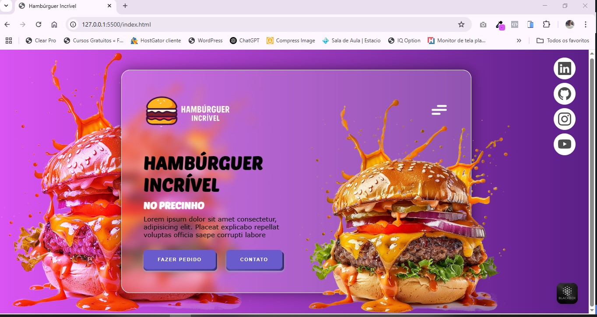
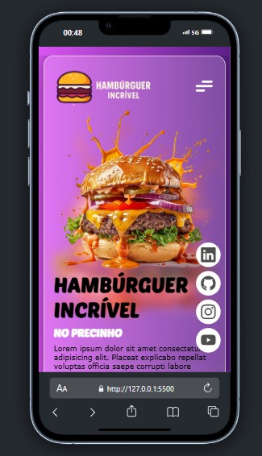

# 🍔 Hambúrguer Incrível - Layout Responsivo

Este é um projeto de layout do Pinterest para uma hamburgueria fictícia chamado **Hambúrguer Incrível**. O objetivo é apresentar um layout moderno, visualmente atrativo e responsivo.



## 🚀 Acesse o Projeto

- 🔗 Repositório: [github.com/danyeljorge/burger_layout](https://github.com/danyeljorge/burger_layout)  
- 🌐 Deploy: [burger-layout.vercel.app](https://burger-layout.vercel.app/)

---

## 🛠️ Tecnologias Utilizadas

- **HTML5**
- **CSS3**
- **Biblioteca UI**: [Uiverse](https://uiverse.io/) – botões e ícones modernos

---

## 📱 Responsividade

O projeto é 100% responsivo, adaptando-se perfeitamente a dispositivos móveis, tablets e desktops.

---

## 🎨 Funcionalidades

- Gradiente de fundo moderno com imagem e efeito blur
- Conteúdo centralizado e animado
- Ícones de redes sociais com estilo flutuante
- Botões interativos com efeito hover
- Estrutura pronta para expansão (cardápio, pedidos, etc.)

---

## 🖼️ Layout



---

## 📦 Como Usar

1. Clone o repositório:
   ```bash
   git clone https://github.com/danyeljorge/burger_layout.git
